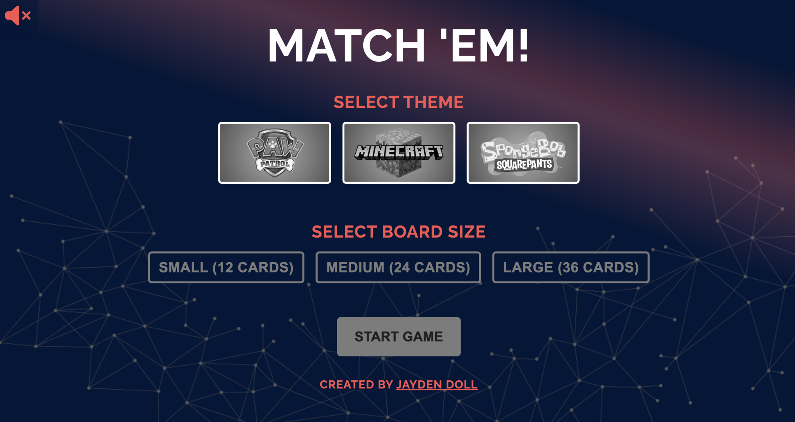
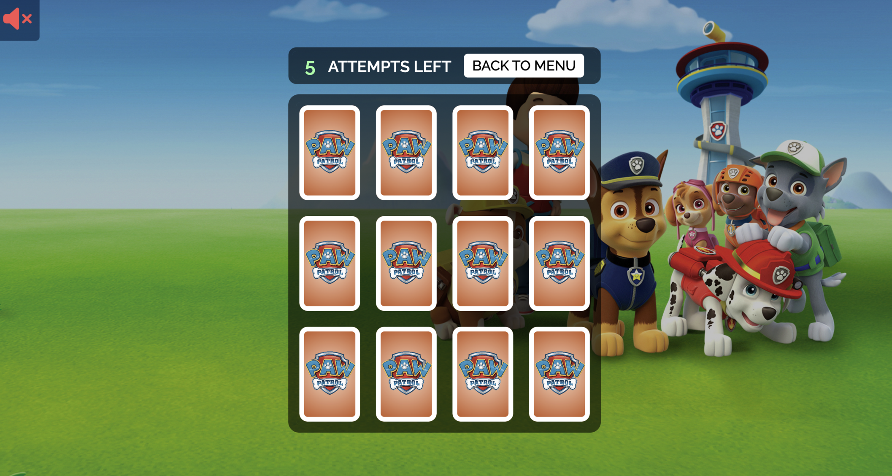
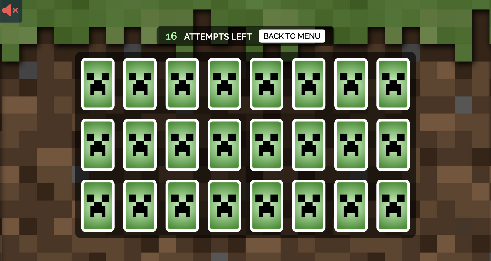
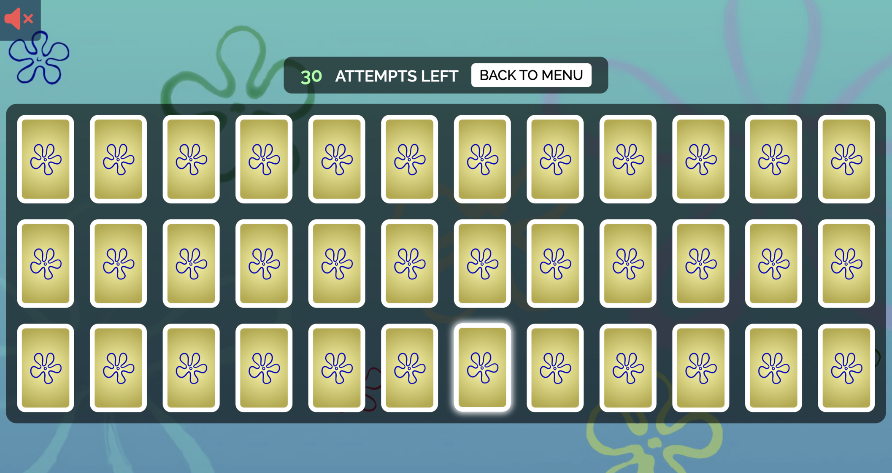
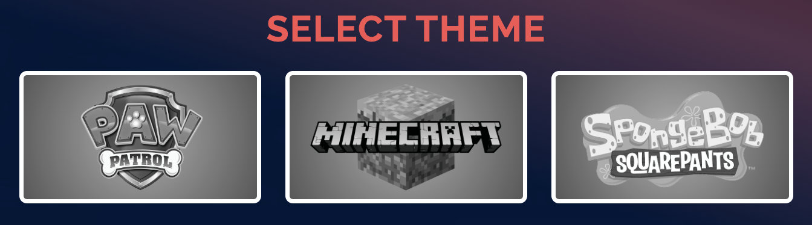

# Match 'Em!

Welcome to Match 'Em, a memory game for kids!

With themes from popular franchises like _'Paw Patrol'_, _'Minecraft'_, and _'Spongebob'_, and 3 board sizes to choose from, you won't want to stop playing!

<a href="https://matchemupgame.com" target="_blank">🃏 Check it out here!</a>

---

_Match'Em Menu Screen_

_Paw Patrol Theme (Small Board)_

_Minecraft Theme (Medium Board)_

_Spongebob Theme (Large Board)_

---

# Features

**-Theme Selector (Changes background image, card back and front images, colors)**

**-Board Size Selector: small (12 cards), medium (24 cards), and large(36 cards)**

**-Sound Toggle (On card match, on card fail, reset game)**

---

# Other Features:

**-Card Hover Animation**

**-Card Match and Fail Indicator**

**-Game reset functionality**

---

## Technologies Used:

HTML

CSS

Javascript

---
